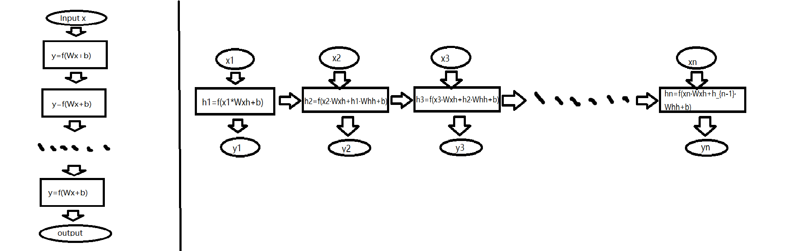
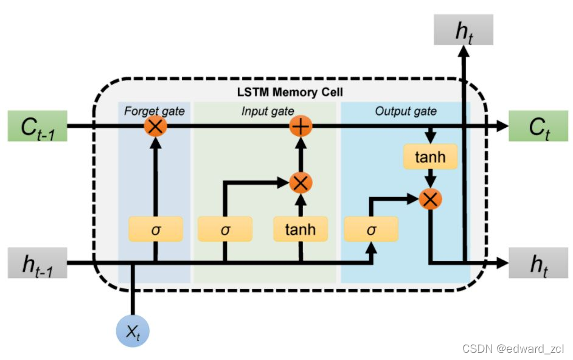
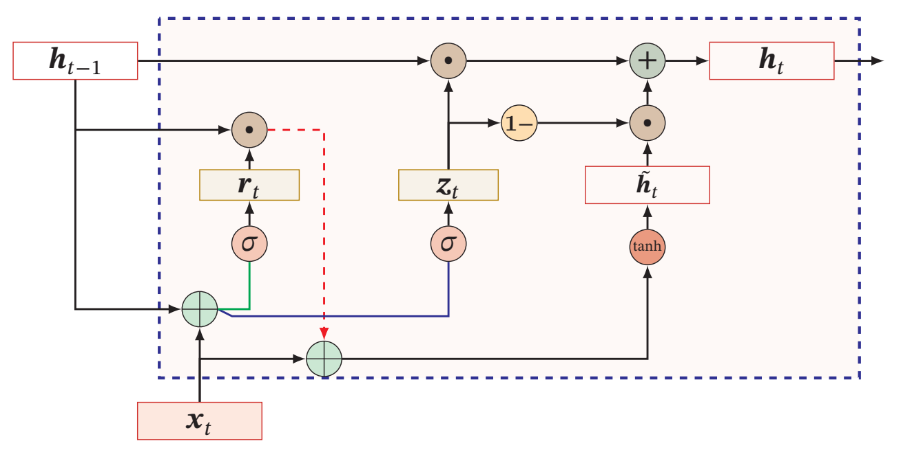

# 序列建模的演进与困境：彻底理解 RNN、LSTM 与 GRU

**前言**

在上一篇文章中，我们学会了把文字变成计算机可以处理的向量——词向量，相当于拿到了处理文字的"数字砖块"。接下来的问题自然是：如何把这些砖块砌成一面能理解"上下文"的墙？语言天生带有顺序，同样几个词，顺序不同，意思可能完全相反。本文将讲述早期的研究者如何试图给模型装上"记忆"，以及这些尝试为何最终走入死局。只有把这份"痛"理解透彻，日后才能真正体会 Transformer 带来的范式革命。

全文将沿着三个问题展开：RNN 是干什么的？它靠什么机制实现？它又卡在了哪里？

## 一、MLP 是"失忆"的，而语言是有顺序的

回顾一下多层感知机（MLP，也就是神经网络的基本形态）。从数学上看，一个训练好的 MLP 就是一个固定的函数 $y = f(x)$：输入 $x$，经过逐层的线性变换与非线性激活，得到输出 $y$。这里要注意"函数"二字的含义——**每一次调用都是独立的**。你输入 $x_1$ 得到 $y_1$，再输入 $x_2$ 得到 $y_2$，这两次计算在底层完全不共享任何内部状态，前一次输入对后一次输出没有任何影响。换句话说，MLP 没有记忆：处理完一个输入就忘，根本不知道上一个输入是什么。

但语言恰恰是讲究顺序的。"我打了他"和"他打了我"，词完全一样，仅因顺序不同，意思就完全相反。如果把每个词独立地喂进 MLP，模型看到的只是一堆孤立的词，看不见顺序，也看不见上下文。这就像一页一页随机抽着读一本书，永远拼不出完整的情节。

因此，要处理语言，就需要一种带记忆的结构：它在处理当前输入时，能够同时参考"之前发生过什么"。这正是循环神经网络（Recurrent Neural Network, RNN）的出发点。

## 二、先明确目标：RNN 最终输出什么？

在讲机制之前，有必要先说清楚 RNN 是用来干什么的。不知道目的，就很容易在过程的细节里迷路。

RNN 的目的，是**处理变长的序列数据（文本、语音等），把它压缩成包含上下文信息的向量，或者直接输出另一个序列，从而完成分类、翻译、预测等任务**。具体而言，最典型的任务形态有三种：

**多对一（Many-to-One）**：输入一整句话，输出一个标签。典型例子是情感分类：模型依次读入"这 / 电影 / 太 / 棒 / 了"，读完最后一个词后，给出"正面 95%、负面 5%"这样的判断，目的是分辨这句话是夸还是骂。

**序列到序列（Seq2Seq）**：输入一个序列，输出另一个序列。典型例子是机器翻译：一个 RNN 作为编码器（Encoder）读入中文"我 / 爱 / 你"，把整句话压缩成一个浓缩语义的**上下文向量**；另一个 RNN 作为解码器（Decoder）依据这个向量，逐个词地生成英文"I → love → you"。

**多对多（Many-to-Many）**：每读入一个词，同时输出一个标签。典型例子是词性标注：对"我 / 吃 / 苹果"，模型同步输出 [代词, 动词, 名词]，用于分析句子的语法结构。

记住这三种形态，后面看 RNN 的内部结构时，就能随时对上号：最终那个隐藏状态，在"多对一"里被送去分类器，在"序列到序列"里被交给解码器，而每个时间步的输出层，则在"多对多"里直接给出预测。

## 三、隐藏状态：记忆的接力赛与状态转移方程

这里会讲解RNN的具体内在机制。

### 1. 直觉：逐格传递的记忆

可以用"接力赛"来理解 RNN 的工作过程。处理"我 / 喜欢 / 吃 / 苹果"这句话时：

- 处理"我"时，第一个节点生成一枚包含"第一人称主语"信息的**记忆胶囊**（隐藏状态 $h_1$）；
- 处理"喜欢"时，第二个节点打开上一个胶囊 $h_1$，同时查看当前词"喜欢"，把两者融合，生成新胶囊 $h_2$，此时记忆内容变成"某人喜欢"；
- 以此类推，直到最后一个词，最终的 $h_4$ 就可以视为整句话的浓缩语义。

值得注意的是，RNN 并没有显式地告诉模型"现在是第几个词"，顺序信息是通过"$h_{t-1}$ 参与当前计算"这种递归结构，隐式地融入记忆之中的。这正是"记忆"二字的数学实现：模型不是把顺序当作一个普通输入变量，而是把**历史信息的压缩总结**当作变量。

### 2. 方程：逐个零件拆解

把上面的过程写成数学，就是 RNN 的核心状态转移方程：

$$h_t = \tanh(W_{hh} h_{t-1} + W_{xh} x_t + b)$$

我们逐个符号解释。

**下标 $t$。** 这里的"时间"不是物理时间（秒），而是序列中的**位置索引**：$t=1$ 表示第 1 个词，$t=2$ 表示第 2 个词。"时间步"只是"处理到第几个数据"的形象说法。

**变量与参数。** 设词向量维度为 $D$，隐藏状态维度为 $H$：

- $x_t \in \mathbb{R}^D$：当前时间步的输入，即第 $t$ 个词的词向量；
- $h_{t-1} \in \mathbb{R}^H$：上一个时间步传过来的隐藏状态，前面所有信息的"压缩包"；
- $W_{xh} \in \mathbb{R}^{H \times D}$：输入权重矩阵，决定当前这个新词对记忆更新贡献多少；
- $W_{hh} \in \mathbb{R}^{H \times H}$：状态权重矩阵，决定过去的记忆被如何变换、保留多少；
- $b \in \mathbb{R}^H$：偏置项，提供基础的阈值。

**激活函数这里用$\tanh$反正切。** 它的定义是

$$\tanh(x) = \frac{e^x - e^{-x}}{e^x + e^{-x}}$$

能把任意大小的数值强行压缩到 $(-1, 1)$ 区间内，其导数为 $\tanh'(x) = 1 - \tanh^2(x) \in (0, 1]$。它在这里的作用是引入非线性，并把状态值约束在稳定范围内，避免数值在迭代计算中失控。但请留意"导数恒不大于 1"这个性质——正是它为后文的梯度消失埋下了伏笔。

把这些零件拼起来，这个方程其实只做一件事：**更新记忆**。

**新记忆 $h_t$ = tanh( 旧记忆的保留 $W_{hh}h_{t-1}$ + 新信息的写入 $W_{xh}x_t$ + 偏置 $b$ )**

每个时间步，模型都在权衡"多大程度参考过去、多大程度相信现在"。训练的过程，就是通过反向传播不断调整 $W_{hh}$ 和 $W_{xh}$，让这种权衡越来越准确。

### 3. 权重共享：整个 RNN 只有几组矩阵

方程中有一个容易忽略、却至关重要的细节：$W_{hh}$、$W_{xh}$、$b$ 在**每一个时间步都完全相同**，这称为**权重共享**。

它的直接后果是：无论句子是 5 个词还是 500 个词，模型的参数数量都不增加。权重共享强迫模型学习的不是"每个位置背一套参数"，而是一条**通用的记忆更新规则**——无论走到哪个位置，都用同一套规则融合旧记忆与新输入。这一点与 CNN 中卷积核在空间位置上共享参数，思想上同源。

把这一点看透，会得到一个非常简洁的结论：一套基础 RNN，循环部分需要训练的参数就是 $W_{hh}$、$W_{xh}$、$b$ 这几组矩阵（再配上输出层面向具体任务的参数）。展开后看似几十步的"深"网络，其实是同一个小模块的反复使用；训练来训练去，训练的正是这几组矩阵。

### 4. 垂直的"层"与水平的"时间步"

初学时一个常见的困惑是：MLP 里有输入层、隐藏层、输出层，RNN 的示意图里似乎也有这些名字，可数据的流向完全不同——那些"隐藏层"到底去哪儿了？

解开这个困惑的钥匙，是把两个方向严格分开。

在 MLP 中，数据是垂直流动的：输入层 → 隐藏层 1 → 隐藏层 2 → 输出层。这里的"层"代表特征提取的深度，低层提取简单特征，高层抽象出复杂特征。

而在基础的 RNN 中，数据主要是水平流动的：从第 1 个词到第 2 个词、第 3 个词……水平方向上不是特征的深度，而是序列的顺序，每一个位置称为一个时间步（Time Step）。把 RNN 沿时间轴"展开（Unroll）"，就得到下面这张经典的对照示意图。

RNN的数据处理流可以按照如图所示的理解：

MLP 与 RNN 展开结构的对照。

- 左：多层感知机，数据自上而下垂直流动，层与层之间没有横向联系，这是"失忆"的图形化表达。而且每层都有不同的权重矩阵和激活向量。

- 右：沿时间轴展开的 RNN，每个方框是一个时间步上的节点，节点内部垂直方向只有"输入层 → h 信息层 → 输出层"这样浅的结构；节点之间的横向箭头，表示隐藏状态从上一个时间步传递到下一个时间步。因此每个节点的 h 信息层都由两部分计算得来——本时间步的输入（在文本任务中通常就是当前词的词向量，而不是字面上的"字节"）和上一个节点的 h，于是 h 像滚雪球一样，含有上文所有内容。

可以看出，基础 RNN 其实是"垂直方向只有一层，水平方向循环往复"。MLP 里理解的垂直深度，在 RNN 这里变成了水平方向上对历史的逐步积累。（后来人们为了增强表达能力，也把多个 RNN 垂直堆叠起来，称为 Stacked RNN，那是后话；本文只讨论最基础的单层形态。）

## 四、两个致命痛点

RNN 在 20 世纪 90 年代到 2010 年代初统治了自然语言处理，但它的架构存在两个无法调和的缺陷。

### 1. 长距离遗忘：梯度消失与梯度爆炸

考虑一个长长的句子："我……（中间一大堆形容词）……是一个热爱学习的人"。模型必须记住第 1 个词"我"，才能正确理解句尾。它记得住吗？

**先看前向传播。** $h_1$ 的信息要传到 $h_{50}$，需经过 49 次矩阵乘法与 $\tanh$ 压缩。每一次 $\tanh$ 都把数值压进 $(-1,1)$，多次非线性映射之后，早期信息对最终状态的影响随距离呈指数级衰减，被稀释到几乎可以忽略。直观地说，就是"忘了"。

**更致命的是反向传播。** RNN 的训练采用沿时间轴的反向传播（BPTT）。由链式法则，损失对 $h_1$ 的梯度，等于 $h_{50}$ 处的梯度连乘 49 个雅可比矩阵 $\partial h_t / \partial h_{t-1}$，而每个雅可比都是 $W_{hh}$ 与一个"对角元为 $\tanh$ 导数"的对角矩阵的乘积。这一长串连乘是收缩还是放大，主要取决于 $W_{hh}$ 的大小（严格说是它的谱半径）：

- 若 $W_{hh}$ 偏小（谱半径小于 1），再乘上恒不大于 1 的 $\tanh$ 导数，连乘 49 次后趋近于 0——**梯度消失**。传到早期时间步的梯度近乎为零，相应参数几乎不再更新，模型学不到长距离依赖。
- 若 $W_{hh}$ 偏大（谱半径大于 1），连乘趋近无穷——**梯度爆炸**，参数更新步长过大，训练直接数值溢出（NaN）。爆炸尚可用梯度裁剪等工程手段缓解，消失则是顽疾。

一句话概括：连乘结构让 RNN 天生不擅长记长远的东西，而且参数大小没有"中间地带"——小了消失，大了爆炸。

### 2. 串行计算：无法并行

第二个痛点不在数学，而在工程。再看状态转移方程：$h_t$ 必须等 $h_{t-1}$ 算完才能开始计算。这意味着处理一个长度为 1000 的序列，就必须**串行**执行 1000 个先后有序的步骤，没有任何绕开的余地。

对照 CNN：一张图片上各个位置的卷积操作相互独立，可以同时交给 GPU 的成千上万个核心。GPU 正是为这种大规模并行矩阵运算而生的硬件，而 RNN 每一步只能执行一次小规模的矩阵运算，其余核心只能空转等待。这好比让一辆重载货车一次只搬一件货——序列越长，算力浪费越明显，训练越慢。

"记不长"与"算不快"，这两个痛点共同决定了后续工作的改进方向。

## 五、LSTM 与 GRU：给记忆装上阀门

### 1. LSTM：记忆的高速公路与三道门

为了缓解梯度消失，科学家给 RNN 加上了"阀门"，其中最经典的是**长短期记忆网络（LSTM**, 1997 年提出，2010 年代大放异彩**）**。本质上是让一个$h$变成了两个。

LSTM 不再只有一个隐藏状态，而是引入两个状态：

- **细胞状态 $C_t$**：一条贯穿整个时间轴的"高速公路"，信息可以在上面几乎无损地流动；
- **隐藏状态 $h_t$**：每个时间步对外输出的"浓缩版"记忆。

为了控制这条高速公路上的信息进出，LSTM 设计了三道**门**。门的本质是 sigmoid 激活函数 $\sigma(x) = 1/(1+e^{-x})$，输出落在 $(0,1)$ 区间，可以解释为"保留的比例"：0 表示完全拦截，1 表示完全放行。

- **遗忘门 $f_t$**：查看 $h_{t-1}$ 和 $x_t$，决定从上一个细胞状态 $C_{t-1}$ 中丢弃哪些无用信息。比如看到句号时，可以选择把上一句的主语 largely 忘掉。
- **输入门 $i_t$ 与候选信息 $\tilde{C}_t$**：决定当前输入中的哪些新信息、以多大比例写入细胞状态。
- **输出门 $o_t$**：决定基于当前细胞状态，暴露哪些信息作为本步的隐藏状态 $h_t$。

写成方程即：

$$f_t = \sigma(W_f [h_{t-1}, x_t] + b_f)$$

$$ i_t = \sigma(W_i [h_{t-1}, x_t] + b_i), \qquad \tilde{C}_t = \tanh(W_C [h_{t-1},x_t] + b_C) $$

$$C_t = f_t \odot C_{t-1} + i_t \odot \tilde{C}_t$$

$$o_t = \sigma(W_o [h_{t-1}, x_t] + b_o), \qquad h_t = o_t \odot \tanh(C_t)$$

其中 $\odot$ 表示逐元素相乘，$[\cdot,\cdot]$ 表示向量拼接。

示意图即为

关键在于 $C_t$ 的更新式：它是**加法**结构——旧记忆按遗忘门比例保留，新信息按输入门比例写入，两者相加。这使得沿细胞状态回传的梯度，主要项变成逐元素门控值的连乘，而不再是"权重矩阵乘小导数"的连乘。只要遗忘门在多数时间步接近 1（极端情形 $f_t=1,\ i_t=0$ 时 $C_t = C_{t-1}$ 原样保留），信息与梯度都能近乎无损地穿越几十上百个时间步。这就是"高速公路"的含义，也是 LSTM 能把记忆长度从十几个词延长到几十上百个词的原因。

### 2. GRU：精简版

**GRU（门控循环单元）** 是 LSTM 的精简版：它把细胞状态并入隐藏状态，把遗忘门与输入门合并为一个**更新门 $z_t$**，另设一个**重置门 $r_t$** 控制计算候选信息时参考多少旧记忆：

$$z_t = \sigma(W_z [h_{t-1}, x_t]), \qquad r_t = \sigma(W_r [h_{t-1}, x_t])$$
$$\tilde{h}_t = \tanh(W [r_t \odot h_{t-1}, x_t])$$
$$h_t = (1 - z_t) \odot h_{t-1} + z_t \odot \tilde{h}_t$$

最后一个方程非常直观：新状态是旧状态 $h_{t-1}$ 与候选状态 $\tilde{h}_t$ 的加权插值，权重由更新门给出。GRU 参数更少、计算更快，效果往往与 LSTM 不相上下，因此在实践中被广泛使用。

示意图即为

### 3. 门控的天花板：架构未变

LSTM/GRU 确实大幅缓解了梯度消失，但请注意，它们只是给循环结构加上了更精巧的阀门，**循环结构本身并没有改变**，于是两个后果不可避免：

1. **依然无法并行。** 无论门控多精巧，$h_t$ 还是得等 $h_{t-1}$，串行依赖链没有被斩断，算力瓶颈依旧。
2. **长距离依赖依然脆弱。** 信息仍要沿时间轴逐格传递，当序列长达几百上千时，即使有门控保护，数百次传递之后也难免衰减与混淆。

给旧马车换上更好的轮子，能让它跑得更稳，但不能让它飞起来。

## 六、抛弃循环：Transformer 的前夜

到 2010 年代中期，领域内逐渐形成共识：要真正理解语言，模型必须能够"一眼看穿整个句子"，直接建立任意两个词之间的联系，而不是像 RNN 那样一个词一个词地传递接力棒。新的架构应当满足三个条件：

1. **全局视野**：任意两个词之间的"距离"都是 1，直接计算关联，彻底解决长距离依赖；
2. **高度并行**：所有位置的计算可以同时进行，充分榨干 GPU 算力；
3. **动态权重**：模型应当根据内容本身，动态决定当前词该关注句中的哪些其他词，而不是套用一套固定的共享规则。

2017 年，Google 团队在论文《Attention Is All You Need》中给出了答案：**彻底抛弃 RNN 的循环结构，也抛弃 CNN 的局部卷积，完全靠"注意力机制（Attention）"来建模。** 这就是 Transformer，一个新时代的起点。